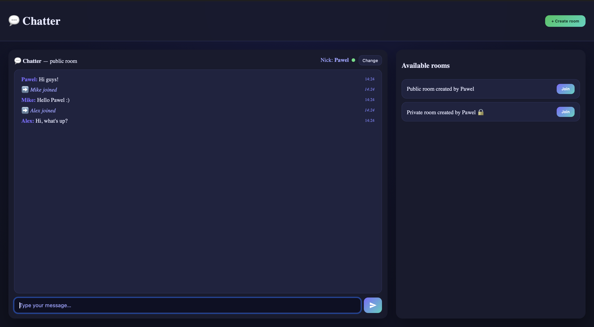
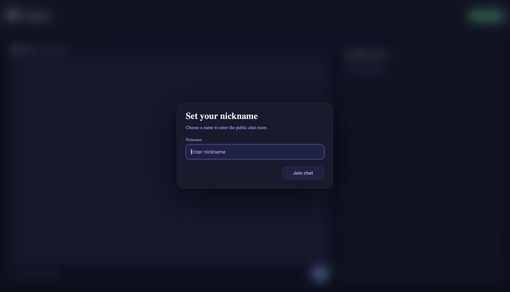
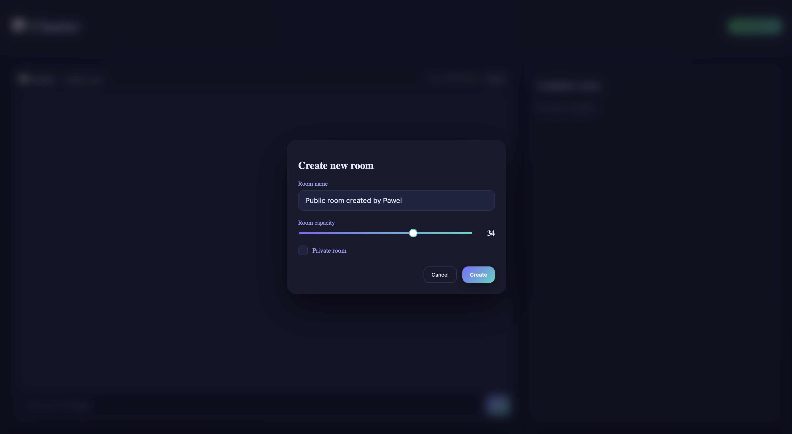
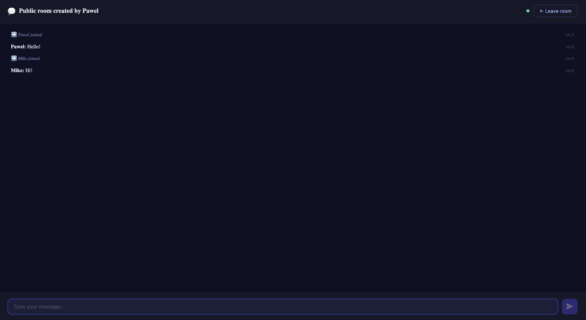
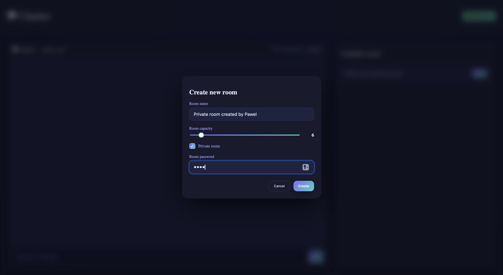
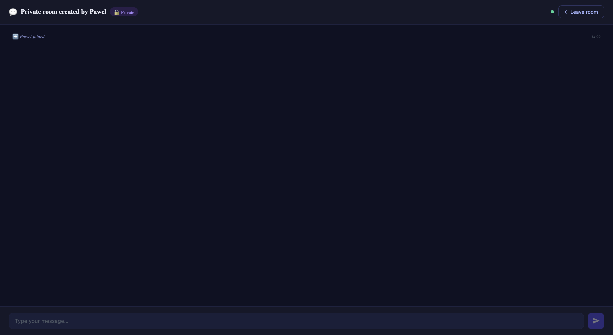
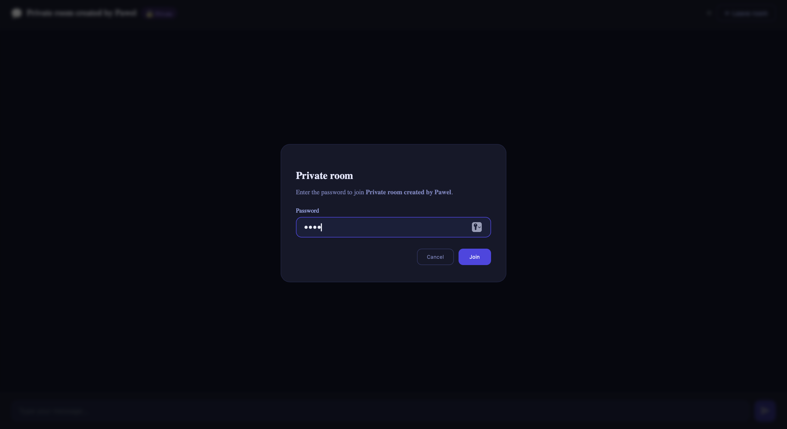

## :bookmark_tabs: About This Project
Chatter is a real-time chat application built with Angular. Users can join a public chat room, create public or private rooms, and exchange messages instantly. Private rooms are protected with a password. The application communicates with the backend via WebSocket using the STOMP protocol.

This repository contains the **frontend section** of the project.

## :hammer_and_wrench: Used Technologies
* Angular
* TypeScript
* HTML, SCSS
* STOMP.js
* SockJS

## :camera: Screenshots
Public chat
:-------------------------:

Nickname modal
:-------------------------:

Create public room      |  Public room chat
:------------------------:|:-------------------------:
  |  

Create private room      |  Private room chat
:------------------------:|:-------------------------:
  |  

Join private room      |
:------------------------:|
  |
